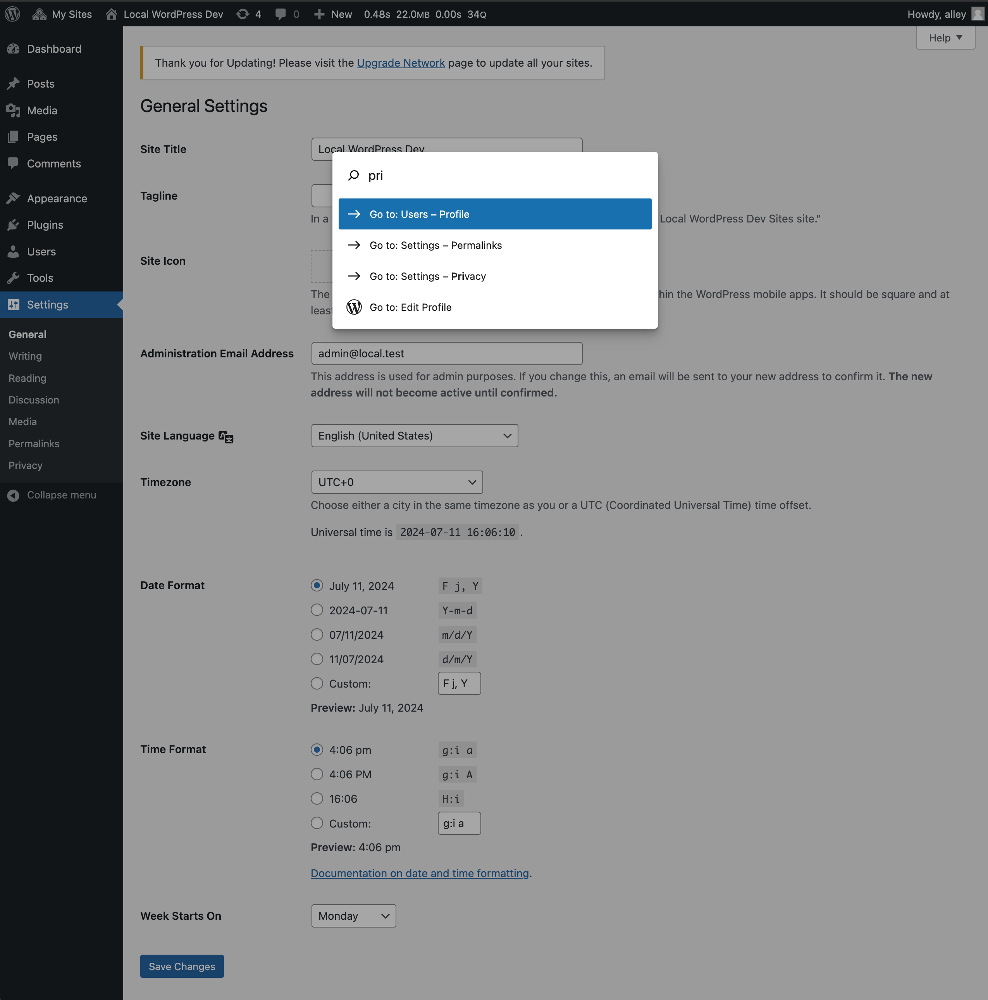

# WP Command Palette

Contributors: alleyinteractive

Tags: alleyinteractive, wp-command-palette

Stable tag: 0.1.1

Requires at least: 6.4

Tested up to: 6.5

Requires PHP: 8.1

License: GPL v2 or later

Extend the WordPress Command Palette with all the available admin menu items.

## Installation

You can install the package via Composer:

```bash
composer require alleyinteractive/wp-command-palette
```

## Usage

Activate the plugin in WordPress and use it like so:



When activated, the plugin will read all the available WordPress admin menu/bar
items and allow you to easily search for them in the
[WordPress Command Palette](https://make.wordpress.org/core/2023/07/17/introducing-the-wordpress-command-palette-api/). You can open the command palette
by pressing `cmd + k` or `ctrl + k` on Windows. The plugin requires WordPress 6.4 or higher.

At some point in the future Gutenberg
[will be adding](https://github.com/WordPress/gutenberg/pull/54515)
site-wide command palette support. This plugin will be updated to support that
when it is available.

## Testing

Run `npm run lint` to run ESLint against all JavaScript files. Linting will also
happen when running development or production builds.

Run `composer test` to run tests against the PHP code in the plugin.

## Releasing the Plugin

The plugin uses a [built release workflow](./.github/workflows/built-release.yml)
to compile and tag releases. Whenever a new version is detected in the root
`composer.json` file or in the plugin's headers, the workflow will automatically
build the plugin and tag it with a new version. The built tag will contain all
the required front-end assets the plugin may require. This works well for
publishing to WordPress.org or for submodule-ing.

When you are ready to release a new version of the plugin, you can run
`npm run release` to start the process of setting up a new release.

## Changelog

Please see [CHANGELOG](CHANGELOG.md) for more information on what has changed recently.

## Credits

This project is actively maintained by [Alley
Interactive](https://github.com/alleyinteractive). Like what you see? [Come work
with us](https://alley.com/careers/).

- [Sean Fisher](https://github.com/srtfisher)
- [All Contributors](../../contributors)

## License

The GNU General Public License (GPL) license. Please see [License File](LICENSE) for more information.
